  <h3>Contribution Activity</h3>  <h3>Selected Projects</h3><table><tr><td width="50%" valign="top">### Superset KPI CardCustom data visualization plugin for Apache Superset.**TypeScript · React · Data Visualization**</td><td width="50%" valign="top">### PostgreSQL / CitusDistributed PostgreSQL infrastructure and data processing.**PostgreSQL · Citus · Docker**</td></tr><tr><td width="50%" valign="top">### Data Warehouse AutomationAutomation and optimization of data warehouse processes.**Python · SQL · Airflow**</td><td width="50%" valign="top">### Data AnalysisData analysis and visualization projects.**Python · SQL · Pandas**</td></tr></table> Data Engineering · Process Automation · Distributed Data · Analytics

