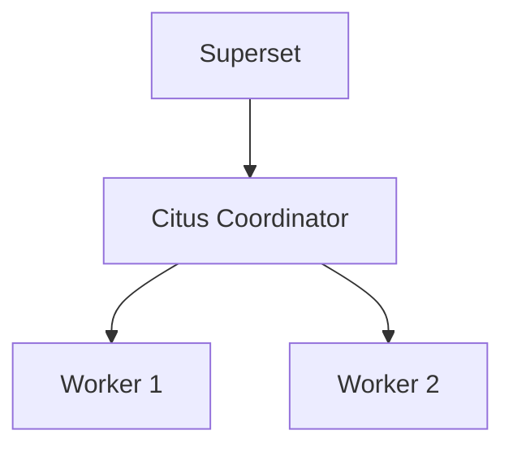

# Citus Architecture Diagram

Use this in your Citus repository README.



Alternative ASCII version:

```text
                 +--------------+
                 |   Superset   |
                 +------+-------+
                        |
                 +------+-------+
                 |   Citus      |
                 | Coordinator  |
                 +------+-------+
                    +---+---+
                    |       |
                    v       v
                Worker 1  Worker 2
```
